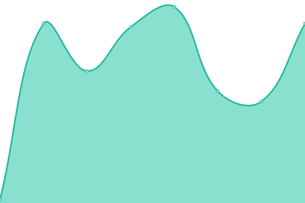
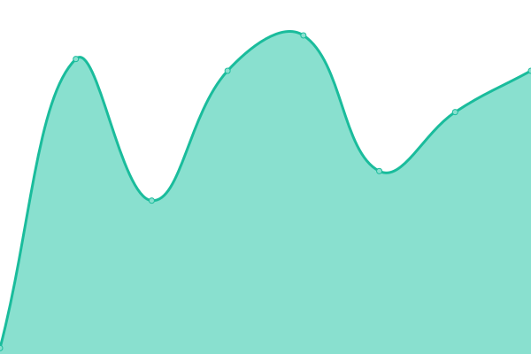
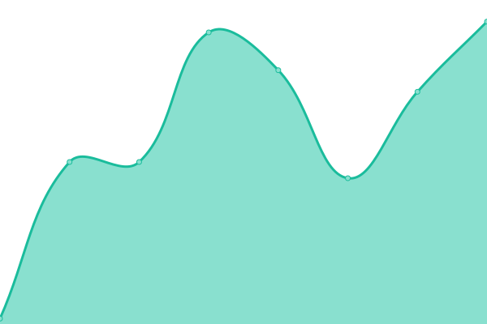

# [📈 Live Status](https://status.kidow.me): <!--live status--> **🟩 All systems operational**

This repository contains the open-source uptime monitor and status page for [kidow](https://kidow.me), powered by [Upptime](https://github.com/upptime/upptime).

With [Upptime](https://upptime.js.org), you can get your own unlimited and free uptime monitor and status page, powered entirely by a GitHub repository. We use [Issues](https://github.com/kidow/status/issues) as incident reports, [Actions](https://github.com/kidow/status/actions) as uptime monitors, and [Pages](https://status.kidow.me) for the status page.

<!--start: status pages-->
<!-- This summary is generated by Upptime (https://github.com/upptime/upptime) -->
<!-- Do not edit this manually, your changes will be overwritten -->
<!-- prettier-ignore -->
| URL | Status | History | Response Time | Uptime |
| --- | ------ | ------- | ------------- | ------ |
|  [admin.](https://admin.kidow.me) | 🟩 Up | [admin.yml](https://github.com/kidow/status/commits/HEAD/history/admin.yml) | 

 232ms
     
 | 

<a href="https://status.kidow.me/history/admin">100.00%</a>
    

|  [archive.](https://archive.kidow.me) | 🟩 Up | [archive.yml](https://github.com/kidow/status/commits/HEAD/history/archive.yml) | 

 209ms
     
 | 

<a href="https://status.kidow.me/history/archive">100.00%</a>
    

|  [blog.](https://blog.kidow.me) | 🟩 Up | [blog.yml](https://github.com/kidow/status/commits/HEAD/history/blog.yml) | 

 182ms
     
 | 

<a href="https://status.kidow.me/history/blog">100.00%</a>
    

|  [components.](https://components.kidow.me) | 🟩 Up | [components.yml](https://github.com/kidow/status/commits/HEAD/history/components.yml) | 

 94ms
     
 | 

<a href="https://status.kidow.me/history/components">82.17%</a>
    

|  [log.](https://log.kidow.me) | 🟩 Up | [log.yml](https://github.com/kidow/status/commits/HEAD/history/log.yml) | 

 160ms
     
 | 

<a href="https://status.kidow.me/history/log">91.02%</a>
    

|  [memo.](https://memo.kidow.me) | 🟩 Up | [memo.yml](https://github.com/kidow/status/commits/HEAD/history/memo.yml) | 

 133ms
     
 | 

<a href="https://status.kidow.me/history/memo">91.46%</a>
    

|  [menu.](https://menu.kidow.me) | 🟩 Up | [menu.yml](https://github.com/kidow/status/commits/HEAD/history/menu.yml) | 

 354ms
     
 | 

<a href="https://status.kidow.me/history/menu">100.00%</a>
    

|  [opengraph.](https://opengraph.kidow.me) | 🟩 Up | [opengraph.yml](https://github.com/kidow/status/commits/HEAD/history/opengraph.yml) | 

 186ms
     
 | 

<a href="https://status.kidow.me/history/opengraph">94.15%</a>
    

|  [portal.](https://portal.kidow.me) | 🟩 Up | [portal.yml](https://github.com/kidow/status/commits/HEAD/history/portal.yml) | 

 98ms
     
 | 

<a href="https://status.kidow.me/history/portal">86.08%</a>
    

|  [resume.](https://resume.kidow.me) | 🟩 Up | [resume.yml](https://github.com/kidow/status/commits/HEAD/history/resume.yml) | 

 133ms
     
 | 

<a href="https://status.kidow.me/history/resume">95.37%</a>
    

|  [www.](https://www.kidow.me) | 🟩 Up | [www.yml](https://github.com/kidow/status/commits/HEAD/history/www.yml) | 

 111ms
     
 | 

<a href="https://status.kidow.me/history/www">93.61%</a>
    

<!--end: status pages-->

[**Visit our status website →**](https://status.kidow.me)

## 📄 License

- Powered by: [Upptime](https://github.com/upptime/upptime)
- Code: [MIT](./LICENSE) © [kidow](https://kidow.me)
- Data in the `./history` directory: [Open Database License](https://opendatacommons.org/licenses/odbl/1-0/)
